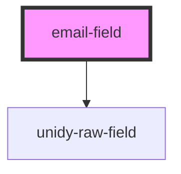

# email-field

<!-- Auto Generated Below -->

## Properties

| Property      | Attribute     | Description | Type     | Default              |
| ------------- | ------------- | ----------- | -------- | -------------------- |
| `className`   | `class-name`  |             | `string` | `""`                 |
| `placeholder` | `placeholder` |             | `string` | `"Enter your email"` |

## Dependencies

### Depends on

- [unidy-raw-field](../../profile/unidy-raw-field)

### Graph

----------------------------------------------

*Built with [StencilJS](https://stenciljs.com/)*
