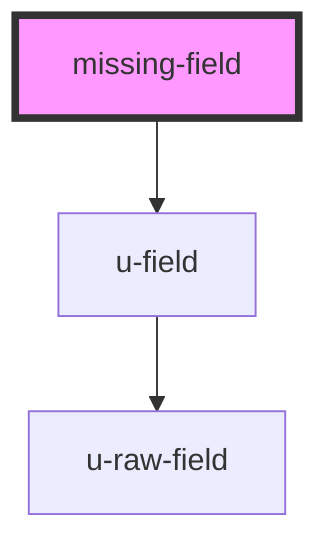

# missing-field

<!-- Auto Generated Below -->

## Properties

| Property | Attribute | Description | Type                                                                                                                                                                                                                                                                                                                                                                                                                                                                                                                                                                                                                                                                                                                                                                                                                                                                                                                                                                                                                                                                                                                                                                                                                                                                                                                                                                                                                                                                                                                                                                                                                                                                                                                                                                                                                                                                                                                                                                                                                                                                                                                                                                                                                                                                                                                                                                                                                                                                                                                                                                                                                                                                                                                                                                                                                                                                                                                                                                                                                                                                                                                                                                                                                                                                                                                                                                                                                            | Default                                   |
| -------- | --------- | ----------- | ------------------------------------------------------------------------------------------------------------------------------------------------------------------------------------------------------------------------------------------------------------------------------------------------------------------------------------------------------------------------------------------------------------------------------------------------------------------------------------------------------------------------------------------------------------------------------------------------------------------------------------------------------------------------------------------------------------------------------------------------------------------------------------------------------------------------------------------------------------------------------------------------------------------------------------------------------------------------------------------------------------------------------------------------------------------------------------------------------------------------------------------------------------------------------------------------------------------------------------------------------------------------------------------------------------------------------------------------------------------------------------------------------------------------------------------------------------------------------------------------------------------------------------------------------------------------------------------------------------------------------------------------------------------------------------------------------------------------------------------------------------------------------------------------------------------------------------------------------------------------------------------------------------------------------------------------------------------------------------------------------------------------------------------------------------------------------------------------------------------------------------------------------------------------------------------------------------------------------------------------------------------------------------------------------------------------------------------------------------------------------------------------------------------------------------------------------------------------------------------------------------------------------------------------------------------------------------------------------------------------------------------------------------------------------------------------------------------------------------------------------------------------------------------------------------------------------------------------------------------------------------------------------------------------------------------------------------------------------------------------------------------------------------------------------------------------------------------------------------------------------------------------------------------------------------------------------------------------------------------------------------------------------------------------------------------------------------------------------------------------------------------------------------------------------- | ----------------------------------------- |
| `fields` | --        |             | `never[] \| { salutation?: { required: boolean; label: string; attr_name: string; value: string \| boolean \| null; type: "radio"; radio_options: { value: string \| boolean \| null; label: string; checked: boolean; }[]; locked?: boolean \| undefined; locked_text?: string \| undefined; } \| undefined; first_name?: { required: boolean; label: string; attr_name: string; value: string \| null; type: "text" \| "textarea"; locked?: boolean \| undefined; locked_text?: string \| undefined; } \| undefined; last_name?: { required: boolean; label: string; attr_name: string; value: string \| null; type: "text" \| "textarea"; locked?: boolean \| undefined; locked_text?: string \| undefined; } \| undefined; email?: { required: boolean; label: string; attr_name: string; value: string \| null; type: "text" \| "textarea"; locked?: boolean \| undefined; locked_text?: string \| undefined; } \| undefined; phone_number?: { required: boolean; label: string; attr_name: string; value: string \| null; type: "tel"; locked?: boolean \| undefined; locked_text?: string \| undefined; } \| undefined; company_name?: { required: boolean; label: string; attr_name: string; value: string \| null; type: "text" \| "textarea"; locked?: boolean \| undefined; locked_text?: string \| undefined; } \| undefined; address_line_1?: { required: boolean; label: string; attr_name: string; value: string \| null; type: "text" \| "textarea"; locked?: boolean \| undefined; locked_text?: string \| undefined; } \| undefined; address_line_2?: { required: boolean; label: string; attr_name: string; value: string \| null; type: "text" \| "textarea"; locked?: boolean \| undefined; locked_text?: string \| undefined; } \| undefined; city?: { required: boolean; label: string; attr_name: string; value: string \| null; type: "text" \| "textarea"; locked?: boolean \| undefined; locked_text?: string \| undefined; } \| undefined; postal_code?: { required: boolean; label: string; attr_name: string; value: string \| null; type: "text" \| "textarea"; locked?: boolean \| undefined; locked_text?: string \| undefined; } \| undefined; country_code?: { required: boolean; label: string; attr_name: string; value: string \| null; type: "select"; options: { value: string; label: string; }[]; locked?: boolean \| undefined; locked_text?: string \| undefined; } \| undefined; date_of_birth?: { required: boolean; label: string; attr_name: string; value: string \| null; type: "date" \| "datetime-local"; locked?: boolean \| undefined; locked_text?: string \| undefined; } \| undefined; preferred_language?: { required: boolean; label: string; attr_name: string; value: string \| null; type: "text" \| "textarea"; locked?: boolean \| undefined; locked_text?: string \| undefined; } \| undefined; custom_attributes?: Record<string, { required: boolean; label: string; attr_name: string; value: string \| number \| boolean \| string[] \| null; type: "number" \| "boolean" \| "radio" \| "text" \| "textarea" \| "tel" \| "select" \| "date" \| "datetime-local" \| "checkbox"; readonly: boolean; locked?: boolean \| undefined; locked_text?: string \| undefined; radio_options?: { value: string \| boolean \| null; label: string; checked: boolean; }[] \| undefined; options?: { value: string; label: string; }[] \| undefined; }> \| undefined; }` | `authState.missingRequiredFields \|\| []` |

## Dependencies

### Depends on

- [u-field](../../profile/field)

### Graph

----------------------------------------------

*Built with [StencilJS](https://stenciljs.com/)*
