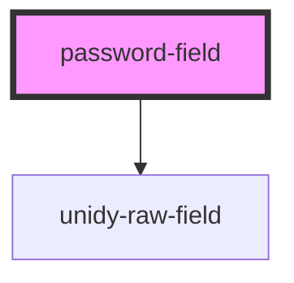

# password-field

<!-- Auto Generated Below -->

## Properties

| Property      | Attribute      | Description | Type     | Default                 |
| ------------- | -------------- | ----------- | -------- | ----------------------- |
| `customStyle` | `custom-style` |             | `string` | `""`                    |
| `placeholder` | `placeholder`  |             | `string` | `"Enter your password"` |

## Dependencies

### Depends on

- [unidy-raw-field](../../profile/unidy-raw-field)

### Graph

----------------------------------------------

*Built with [StencilJS](https://stenciljs.com/)*
