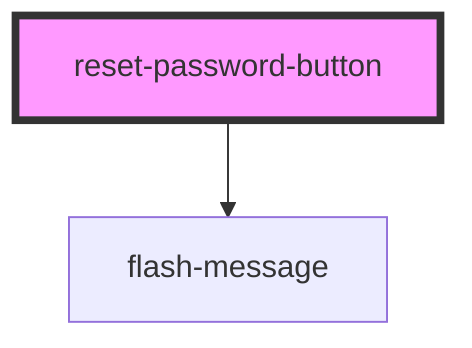

# reset-pass-button

<!-- Auto Generated Below -->

## Properties

| Property             | Attribute         | Description | Type     | Default                                                 |
| -------------------- | ----------------- | ----------- | -------- | ------------------------------------------------------- |
| `componentClassName` | `class-name`      |             | `string` | `""`                                                    |
| `successMessage`     | `success-message` |             | `string` | `"Password reset email sent. Please check your inbox."` |
| `text`               | `text`            |             | `string` | `"Reset Password"`                                      |

## Dependencies

### Depends on

- [flash-message](../../shared/flash-message)

### Graph

----------------------------------------------

*Built with [StencilJS](https://stenciljs.com/)*
