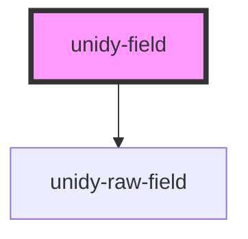

# unidy-field

<!-- Auto Generated Below -->

## Properties

| Property                   | Attribute                     | Description | Type                             | Default                                |
| -------------------------- | ----------------------------- | ----------- | -------------------------------- | -------------------------------------- |
| `countryCodeDisplayOption` | `country-code-display-option` |             | `"icon" \| "label" \| undefined` | `"label"`                              |
| `customStyle`              | `custom-style`                |             | `string \| undefined`            | `undefined`                            |
| `emptyOption`              | `empty-option`                |             | `boolean`                        | `true`                                 |
| `field` _(required)_       | `field`                       |             | `string`                         | `undefined`                            |
| `invalidPhoneMessage`      | `invalid-phone-message`       |             | `string`                         | `"Please enter a valid phone number."` |
| `placeholder`              | `placeholder`                 |             | `string \| undefined`            | `undefined`                            |
| `readonlyPlaceholder`      | `readonly-placeholder`        |             | `string`                         | `""`                                   |
| `required`                 | `required`                    |             | `boolean`                        | `false`                                |

## Shadow Parts

| Part                                | Description |
| ----------------------------------- | ----------- |
| `"checkbox"`                        |             |
| `"checkbox-group"`                  |             |
| `"checkbox-label"`                  |             |
| `"field-error-message"`             |             |
| `"input"`                           |             |
| `"label"`                           |             |
| `"multi-select-readonly-container"` |             |
| `"multi-select-readonly-field"`     |             |
| `"option"`                          |             |
| `"radio"`                           |             |
| `"radio-checked"`                   |             |
| `"radio-group"`                     |             |
| `"radio-label"`                     |             |
| `"readonly-indicator"`              |             |
| `"required-indicator"`              |             |
| `"select"`                          |             |
| `"textarea"`                        |             |

## Dependencies

### Depends on

- [unidy-raw-field](../unidy-raw-field)

### Graph

----------------------------------------------

*Built with [StencilJS](https://stenciljs.com/)*
