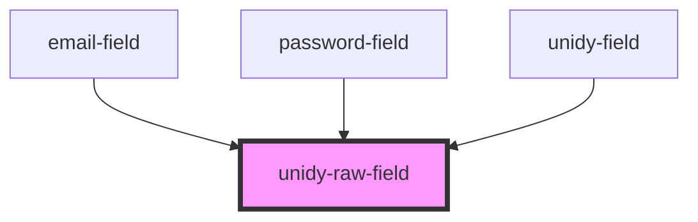

# unidy-field

<!-- Auto Generated Below -->

## Properties

| Property                   | Attribute                     | Description | Type                               | Default                                |
| -------------------------- | ----------------------------- | ----------- | ---------------------------------- | -------------------------------------- |
| `attrName`                 | `attr-name`                   |             | `string \| undefined`              | `undefined`                            |
| `checked`                  | `checked`                     |             | `boolean \| undefined`             | `undefined`                            |
| `countryCodeDisplayOption` | `country-code-display-option` |             | `"icon" \| "label" \| undefined`   | `"label"`                              |
| `customStyle`              | `custom-style`                |             | `string \| undefined`              | `undefined`                            |
| `disabled`                 | `disabled`                    |             | `boolean \| undefined`             | `undefined`                            |
| `emptyOption`              | `empty-option`                |             | `boolean`                          | `false`                                |
| `field` _(required)_       | `field`                       |             | `string`                           | `undefined`                            |
| `invalidPhoneMessage`      | `invalid-phone-message`       |             | `string`                           | `"Please enter a valid phone number."` |
| `multiSelectOptions`       | --                            |             | `MultiSelectOption[] \| undefined` | `undefined`                            |
| `options`                  | `options`                     |             | `Option[] \| string \| undefined`  | `undefined`                            |
| `placeholder`              | `placeholder`                 |             | `string \| undefined`              | `undefined`                            |
| `radioOptions`             | --                            |             | `RadioOption[] \| undefined`       | `undefined`                            |
| `readonlyPlaceholder`      | `readonly-placeholder`        |             | `string`                           | `""`                                   |
| `required`                 | `required`                    |             | `boolean`                          | `false`                                |
| `specificPartKey`          | `specific-part-key`           |             | `string \| undefined`              | `undefined`                            |
| `store`                    | `store`                       |             | `"none" \| "profile"`              | `"profile"`                            |
| `tooltip`                  | `tooltip`                     |             | `string \| undefined`              | `undefined`                            |
| `type` _(required)_        | `type`                        |             | `string`                           | `undefined`                            |
| `value`                    | `value`                       |             | `string \| string[] \| undefined`  | `undefined`                            |

## Dependencies

### Used by

 - [email-field](../../auth/email-field)
 - [password-field](../../auth/password-field)
 - [unidy-field](../unidy-field)

### Graph

----------------------------------------------

*Built with [StencilJS](https://stenciljs.com/)*
