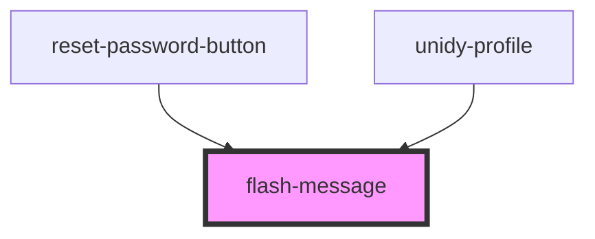

# error-message

<!-- Auto Generated Below -->

## Properties

| Property  | Attribute | Description | Type                             | Default  |
| --------- | --------- | ----------- | -------------------------------- | -------- |
| `message` | `message` |             | `string`                         | `""`     |
| `variant` | `variant` |             | `"error" \| "info" \| "success"` | `"info"` |

## Dependencies

### Used by

 - [reset-password-button](../../auth/reset-pass-button)
 - [unidy-profile](../../profile/unidy-profile)

### Graph

----------------------------------------------

*Built with [StencilJS](https://stenciljs.com/)*
