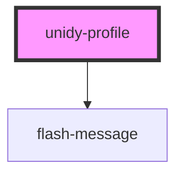

# unidy-profile

<!-- Auto Generated Below -->

## Properties

| Property      | Attribute      | Description | Type                                 | Default                                                                                                                                                                                                         |
| ------------- | -------------- | ----------- | ------------------------------------ | --------------------------------------------------------------------------------------------------------------------------------------------------------------------------------------------------------------- |
| `apiKey`      | `api-key`      |             | `string \| undefined`                | `undefined`                                                                                                                                                                                                     |
| `apiUrl`      | `api-url`      |             | `string \| undefined`                | `undefined`                                                                                                                                                                                                     |
| `initialData` | `initial-data` |             | `string \| { [x: string]: string; }` | `""`                                                                                                                                                                                                            |
| `language`    | `language`     |             | `string \| undefined`                | `undefined`                                                                                                                                                                                                     |
| `profileId`   | `profile-id`   |             | `string \| undefined`                | `undefined`                                                                                                                                                                                                     |
| `store`       | `store`        |             | `ObservableMap<ProfileStore>`        | `createStore<ProfileStore>({     loading: true,     data: {},     configuration: {},     errors: {},     idToken: "",     client: undefined,     flashErrors: {},     language: "",     phoneValid: true,   })` |

## Dependencies

### Depends on

- [flash-message](../unidy-flash)

### Graph

----------------------------------------------

*Built with [StencilJS](https://stenciljs.com/)*
