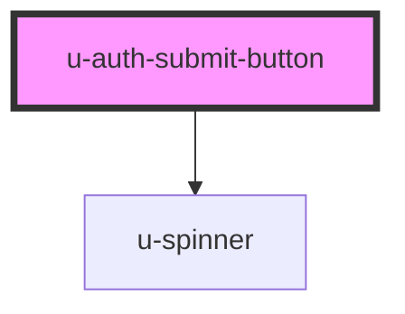

# submit-button

<!-- Auto Generated Below -->

## Properties

| Property             | Attribute    | Description | Type                    | Default     |
| -------------------- | ------------ | ----------- | ----------------------- | ----------- |
| `componentClassName` | `class-name` |             | `string`                | `""`        |
| `disabled`           | `disabled`   |             | `boolean`               | `false`     |
| `for`                | `for`        |             | `"email" \| "password"` | `undefined` |
| `text`               | `text`       |             | `string`                | `""`        |

## Dependencies

### Depends on

- [u-spinner](../../../shared/components/spinner)

### Graph

----------------------------------------------

*Built with [StencilJS](https://stenciljs.com/)*
