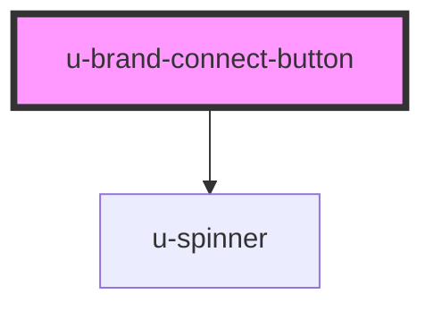

# u-brand-connect-button

<!-- Auto Generated Below -->

## Properties

| Property             | Attribute    | Description | Type                    | Default     |
| -------------------- | ------------ | ----------- | ----------------------- | ----------- |
| `action`             | `action`     |             | `"cancel" \| "connect"` | `"connect"` |
| `componentClassName` | `class-name` |             | `string`                | `""`        |

## Dependencies

### Depends on

- [u-spinner](../../../shared/components/spinner)

### Graph

----------------------------------------------

*Built with [StencilJS](https://stenciljs.com/)*
