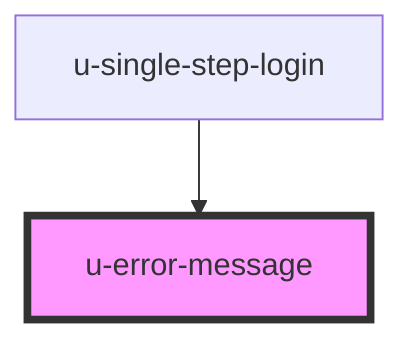

# unidy-auth-error-message

<!-- Auto Generated Below -->

## Properties

| Property             | Attribute    | Description | Type                                                                | Default     |
| -------------------- | ------------ | ----------- | ------------------------------------------------------------------- | ----------- |
| `componentClassName` | `class-name` |             | `string`                                                            | `""`        |
| `errorMessages`      | --           |             | `{ [x: string]: string; }`                                          | `undefined` |
| `for` _(required)_   | `for`        |             | `"connection" \| "email" \| "general" \| "magicCode" \| "password"` | `undefined` |

## Dependencies

### Used by

 - [u-single-step-login](../single-step-login)

### Graph

----------------------------------------------

*Built with [StencilJS](https://stenciljs.com/)*
