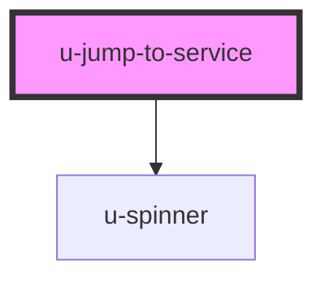

# u-jump-to-service

<!-- Auto Generated Below -->

## Properties

| Property                 | Attribute                  | Description                                                                                          | Type      | Default     |
| ------------------------ | -------------------------- | ---------------------------------------------------------------------------------------------------- | --------- | ----------- |
| `componentClassName`     | `class-name`               | Custom CSS class name(s) to apply to the button element.                                             | `string`  | `""`        |
| `newtab`                 | `newtab`                   | If true, opens the URL in a new tab. Defaults to false.                                              | `boolean` | `false`     |
| `redirectUri`            | `redirect-uri`             | Optional redirect URI for the OAuth flow. Must match one of the application's allowed redirect URIs. | `string`  | `undefined` |
| `scopes`                 | `scopes`                   | Comma-separated list of OAuth scopes to request. Defaults to ["openid"] if not provided.             | `string`  | `undefined` |
| `serviceId` _(required)_ | `service-id`               | The OAuth Application ID (service ID) to jump to.                                                    | `string`  | `undefined` |
| `skipOauthAuthorization` | `skip-oauth-authorization` | If true, skips the OAuth authorization step (if already authorized once). Defaults to false.         | `boolean` | `false`     |

## Dependencies

### Depends on

- [u-spinner](../../../shared/components/spinner)

### Graph

----------------------------------------------

*Built with [StencilJS](https://stenciljs.com/)*
