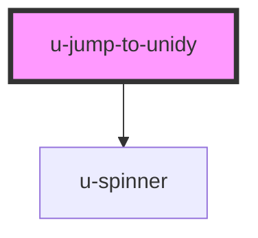

# u-jump-to-unidy

<!-- Auto Generated Below -->

## Properties

| Property             | Attribute    | Description                                              | Type      | Default     |
| -------------------- | ------------ | -------------------------------------------------------- | --------- | ----------- |
| `componentClassName` | `class-name` | Custom CSS class name(s) to apply to the button element. | `string`  | `""`        |
| `newtab`             | `newtab`     | If true, opens the URL in a new tab. Defaults to false.  | `boolean` | `false`     |
| `path` _(required)_  | `path`       | The Unidy path to redirect to. Must start with "/".      | `string`  | `undefined` |

## Dependencies

### Depends on

- [u-spinner](../../../shared/components/spinner)

### Graph

----------------------------------------------

*Built with [StencilJS](https://stenciljs.com/)*
