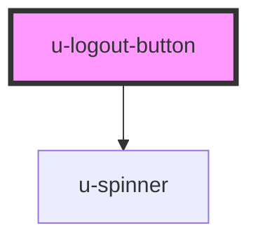

# u-logout-button

<!-- Auto Generated Below -->

## Properties

| Property             | Attribute           | Description | Type      | Default |
| -------------------- | ------------------- | ----------- | --------- | ------- |
| `componentClassName` | `class-name`        |             | `string`  | `""`    |
| `reloadOnSuccess`    | `reload-on-success` |             | `boolean` | `true`  |

## Events

| Event    | Description | Type                |
| -------- | ----------- | ------------------- |
| `logout` |             | `CustomEvent<void>` |

## Dependencies

### Depends on

- [u-spinner](../../../shared/components/spinner)

### Graph

----------------------------------------------

*Built with [StencilJS](https://stenciljs.com/)*
