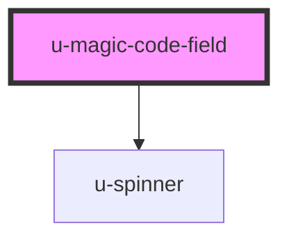

# u-magic-code-field

<!-- Auto Generated Below -->

## Properties

| Property             | Attribute    | Description | Type     | Default |
| -------------------- | ------------ | ----------- | -------- | ------- |
| `componentClassName` | `class-name` |             | `string` | `""`    |

## Shadow Parts

| Part            | Description |
| --------------- | ----------- |
| `"digit-input"` |             |

## Dependencies

### Depends on

- [u-spinner](../../../shared/components/spinner)

### Graph

----------------------------------------------

*Built with [StencilJS](https://stenciljs.com/)*
