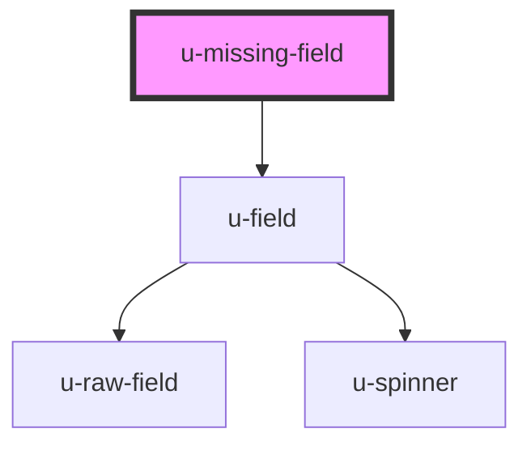

# u-missing-field

<!-- Auto Generated Below -->

## Properties

| Property             | Attribute    | Description | Type     | Default     |
| -------------------- | ------------ | ----------- | -------- | ----------- |
| `componentClassName` | `class-name` |             | `string` | `undefined` |

## Dependencies

### Depends on

- [u-field](../../../profile/components/field)

### Graph

----------------------------------------------

*Built with [StencilJS](https://stenciljs.com/)*
