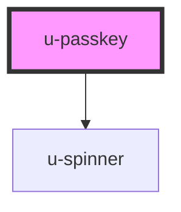

# u-passkey

<!-- Auto Generated Below -->

## Properties

| Property             | Attribute           | Description | Type      | Default |
| -------------------- | ------------------- | ----------- | --------- | ------- |
| `ariaDescribedBy`    | `aria-described-by` |             | `string`  | `""`    |
| `componentClassName` | `class-name`        |             | `string`  | `""`    |
| `disabled`           | `disabled`          |             | `boolean` | `false` |

## Dependencies

### Depends on

- [u-spinner](../../../shared/components/spinner)

### Graph

----------------------------------------------

*Built with [StencilJS](https://stenciljs.com/)*
