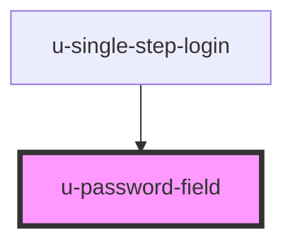

# password-field

<!-- Auto Generated Below -->

## Properties

| Property             | Attribute     | Description | Type                      | Default                 |
| -------------------- | ------------- | ----------- | ------------------------- | ----------------------- |
| `ariaLabel`          | `aria-label`  |             | `string`                  | `"Password"`            |
| `componentClassName` | `class-name`  |             | `string`                  | `""`                    |
| `mode`               | `mode`        |             | `"single-step" \| "step"` | `"step"`                |
| `placeholder`        | `placeholder` |             | `string`                  | `"Enter your password"` |

## Dependencies

### Used by

 - [u-single-step-login](../single-step-login)

### Graph

----------------------------------------------

*Built with [StencilJS](https://stenciljs.com/)*
