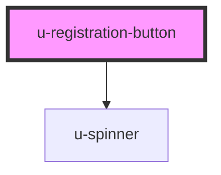

# u-registration-button

<!-- Auto Generated Below -->

## Properties

| Property             | Attribute      | Description | Type      | Default                |
| -------------------- | -------------- | ----------- | --------- | ---------------------- |
| `componentClassName` | `class-name`   |             | `string`  | `""`                   |
| `for` _(required)_   | `for`          |             | `"email"` | `undefined`            |
| `redirectUri`        | `redirect-uri` |             | `string`  | `window.location.href` |
| `text`               | `text`         |             | `string`  | `""`                   |

## Dependencies

### Depends on

- [u-spinner](../../../shared/components/spinner)

### Graph

----------------------------------------------

*Built with [StencilJS](https://stenciljs.com/)*
