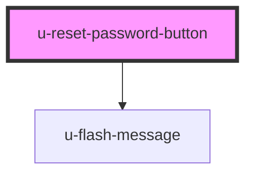

# reset-pass-button

<!-- Auto Generated Below -->

## Properties

| Property             | Attribute    | Description | Type     | Default            |
| -------------------- | ------------ | ----------- | -------- | ------------------ |
| `componentClassName` | `class-name` |             | `string` | `""`               |
| `text`               | `text`       |             | `string` | `"Reset Password"` |

## Dependencies

### Depends on

- [u-flash-message](../../../shared/components/flash-message)

### Graph

----------------------------------------------

*Built with [StencilJS](https://stenciljs.com/)*
