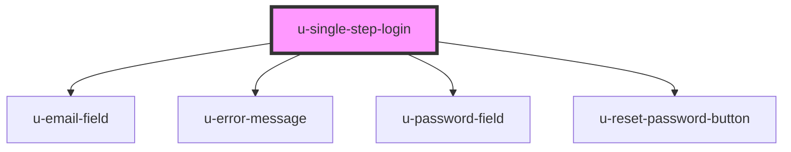

# u-single-step-login

<!-- Auto Generated Below -->

## Dependencies

### Depends on

- [u-email-field](../email-field)
- [u-error-message](../error-message)
- [u-password-field](../password-field)
- [u-reset-password-button](../reset-pass-button)

### Graph

----------------------------------------------

*Built with [StencilJS](https://stenciljs.com/)*
