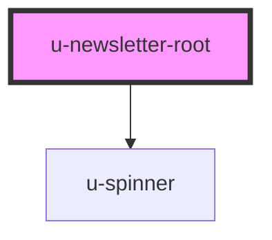

# u-newsletter-root

<!-- Auto Generated Below -->

## Properties

| Property             | Attribute    | Description | Type     | Default |
| -------------------- | ------------ | ----------- | -------- | ------- |
| `componentClassName` | `class-name` |             | `string` | `""`    |

## Events

| Event                | Description | Type                                                     |
| -------------------- | ----------- | -------------------------------------------------------- |
| `uNewsletterError`   |             | `CustomEvent<{ email: string; error: string; }>`         |
| `uNewsletterSuccess` |             | `CustomEvent<{ email: string; newsletters: string[]; }>` |

## Methods

### `submit(forType?: NewsletterButtonFor) => Promise<void>`

#### Parameters

| Name      | Type                  | Description |
| --------- | --------------------- | ----------- |
| `forType` | `"login" \| "create"` |             |

#### Returns

Type: `Promise<void>`

## Dependencies

### Depends on

- [u-spinner](../../../shared/components/spinner)

### Graph

----------------------------------------------

*Built with [StencilJS](https://stenciljs.com/)*
