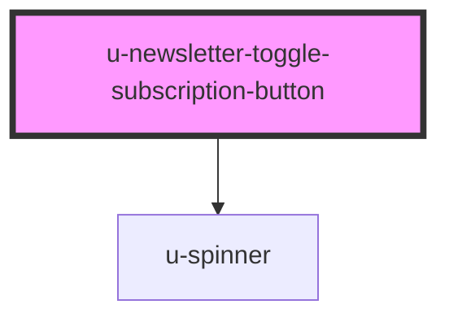

# u-newsletter-toggle-subscription-button

<!-- Auto Generated Below -->

## Properties

| Property                    | Attribute                | Description | Type     | Default     |
| --------------------------- | ------------------------ | ----------- | -------- | ----------- |
| `componentClassName`        | `class-name`             |             | `string` | `""`        |
| `internalName` _(required)_ | `internal-name`          |             | `string` | `undefined` |
| `subscribeClassName`        | `subscribe-class-name`   |             | `string` | `""`        |
| `unsubscribeClassName`      | `unsubscribe-class-name` |             | `string` | `""`        |

## Dependencies

### Depends on

- [u-spinner](../../../shared/components/spinner)

### Graph

----------------------------------------------

*Built with [StencilJS](https://stenciljs.com/)*
