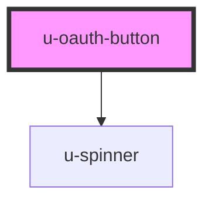

# u-oauth-button

<!-- Auto Generated Below -->

## Properties

| Property             | Attribute    | Description                                                                                                                                          | Type                                | Default     |
| -------------------- | ------------ | ---------------------------------------------------------------------------------------------------------------------------------------------------- | ----------------------------------- | ----------- |
| `action`             | `action`     | The action this button performs. - "connect": Start the OAuth flow (default) - "submit": Submit the consent form - "cancel": Cancel the consent flow | `"cancel" \| "connect" \| "submit"` | `"connect"` |
| `componentClassName` | `class-name` | Custom CSS class name(s) to apply to the button element.                                                                                             | `string`                            | `""`        |

## Dependencies

### Depends on

- [u-spinner](../../../shared/components/spinner)

### Graph

----------------------------------------------

*Built with [StencilJS](https://stenciljs.com/)*
