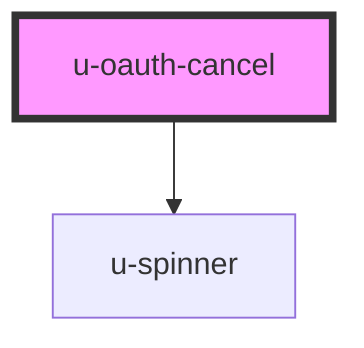

# u-oauth-cancel

<!-- Auto Generated Below -->

## Properties

| Property             | Attribute    | Description                                              | Type     | Default |
| -------------------- | ------------ | -------------------------------------------------------- | -------- | ------- |
| `componentClassName` | `class-name` | Custom CSS class name(s) to apply to the button element. | `string` | `""`    |

## Dependencies

### Depends on

- [u-spinner](../../../shared/components/spinner)

### Graph

----------------------------------------------

*Built with [StencilJS](https://stenciljs.com/)*
