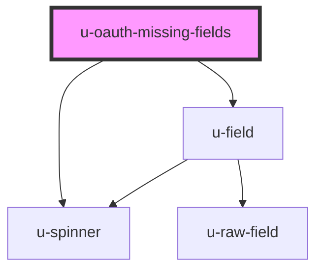

# u-oauth-missing-fields

<!-- Auto Generated Below -->

## Properties

| Property             | Attribute          | Description                                    | Type     | Default |
| -------------------- | ------------------ | ---------------------------------------------- | -------- | ------- |
| `componentClassName` | `class-name`       | CSS classes to apply to the container element. | `string` | `""`    |
| `fieldClassName`     | `field-class-name` | CSS classes to apply to each field element.    | `string` | `""`    |

## Dependencies

### Depends on

- [u-spinner](../../../shared/components/spinner)
- [u-field](../../../profile/components/field)

### Graph

----------------------------------------------

*Built with [StencilJS](https://stenciljs.com/)*
