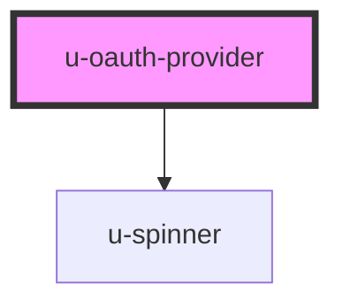

# u-oauth-provider

<!-- Auto Generated Below -->

## Properties

| Property                | Attribute       | Description | Type      | Default     |
| ----------------------- | --------------- | ----------- | --------- | ----------- |
| `autoRedirect`          | `auto-redirect` |             | `boolean` | `true`      |
| `clientId` _(required)_ | `client-id`     |             | `string`  | `undefined` |
| `newtab`                | `newtab`        |             | `boolean` | `false`     |
| `redirectUri`           | `redirect-uri`  |             | `string`  | `undefined` |
| `scopes`                | `scopes`        |             | `string`  | `undefined` |

## Events

| Event          | Description | Type                             |
| -------------- | ----------- | -------------------------------- |
| `oauthCancel`  |             | `CustomEvent<void>`              |
| `oauthError`   |             | `CustomEvent<OAuthErrorEvent>`   |
| `oauthSuccess` |             | `CustomEvent<OAuthSuccessEvent>` |

## Methods

### `cancel() => Promise<void>`

#### Returns

Type: `Promise<void>`

### `connect() => Promise<void>`

#### Returns

Type: `Promise<void>`

### `submit() => Promise<void>`

#### Returns

Type: `Promise<void>`

## Dependencies

### Depends on

- [u-spinner](../../../shared/components/spinner)

### Graph

----------------------------------------------

*Built with [StencilJS](https://stenciljs.com/)*
