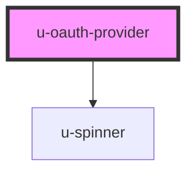

# u-oauth-provider

<!-- Auto Generated Below -->

## Properties

| Property                | Attribute       | Description                                                                                                       | Type      | Default     |
| ----------------------- | --------------- | ----------------------------------------------------------------------------------------------------------------- | --------- | ----------- |
| `autoRedirect`          | `auto-redirect` | If true, automatically redirect after successful consent. If false, emits the success event but doesn't redirect. | `boolean` | `true`      |
| `clientId` _(required)_ | `client-id`     | The OAuth application client ID (uid).                                                                            | `string`  | `undefined` |
| `newtab`                | `newtab`        | If true, opens the redirect URL in a new tab.                                                                     | `boolean` | `false`     |
| `redirectUri`           | `redirect-uri`  | Custom redirect URI for the OAuth flow. Must match one of the application's allowed redirect URIs.                | `string`  | `undefined` |
| `scopes`                | `scopes`        | Custom OAuth scopes to request, comma-separated. If not provided, uses the application's default scopes.          | `string`  | `undefined` |

## Events

| Event          | Description                                         | Type                             |
| -------------- | --------------------------------------------------- | -------------------------------- |
| `oauthCancel`  | Emitted when the user cancels the consent flow.     | `CustomEvent<void>`              |
| `oauthError`   | Emitted when an error occurs during the OAuth flow. | `CustomEvent<OAuthErrorEvent>`   |
| `oauthSuccess` | Emitted when consent is successfully granted.       | `CustomEvent<OAuthSuccessEvent>` |

## Methods

### `cancel() => Promise<void>`

Cancel the consent flow.
Called by oauth-cancel or close button.

#### Returns

Type: `Promise<void>`

### `connect() => Promise<void>`

Start the OAuth connect flow.
Called by oauth-button or can be called programmatically.

#### Returns

Type: `Promise<void>`

### `submit() => Promise<void>`

Submit the consent form (grant consent with optional field updates).
Called by oauth-submit.

#### Returns

Type: `Promise<void>`

## Dependencies

### Depends on

- [u-spinner](../../../shared/components/spinner)

### Graph

----------------------------------------------

*Built with [StencilJS](https://stenciljs.com/)*
