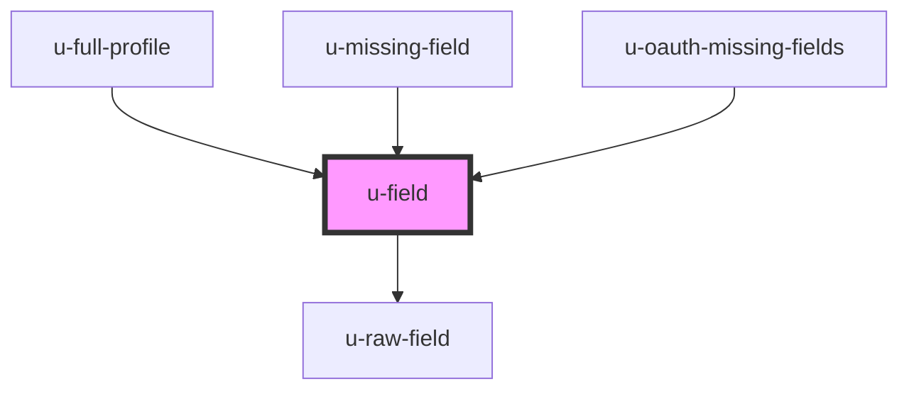

# u-field

<!-- Auto Generated Below -->

## Properties

| Property                   | Attribute                     | Description                                                                  | Type                                                                   | Default                                |
| -------------------------- | ----------------------------- | ---------------------------------------------------------------------------- | ---------------------------------------------------------------------- | -------------------------------------- |
| `componentClassName`       | `class-name`                  | CSS classes to apply to the input element.                                   | `string`                                                               | `undefined`                            |
| `countryCodeDisplayOption` | `country-code-display-option` | For phone fields: how to display country code selector ('icon' or 'label').  | `"icon" \| "label"`                                                    | `"label"`                              |
| `emptyOption`              | `empty-option`                | If true, includes an empty option in select dropdowns.                       | `boolean`                                                              | `true`                                 |
| `field` _(required)_       | `field`                       | The field name (e.g., 'first_name', 'custom_attributes.favorite_color').     | `string`                                                               | `undefined`                            |
| `invalidPhoneMessage`      | `invalid-phone-message`       | Error message shown when phone number validation fails.                      | `string`                                                               | `"Please enter a valid phone number."` |
| `pattern`                  | `pattern`                     | Regex pattern for custom validation.                                         | `string`                                                               | `undefined`                            |
| `patternErrorMessage`      | `pattern-error-message`       | Error message shown when pattern validation fails.                           | `string`                                                               | `undefined`                            |
| `placeholder`              | `placeholder`                 | Placeholder text for the input field.                                        | `string`                                                               | `undefined`                            |
| `readonlyPlaceholder`      | `readonly-placeholder`        | Placeholder text shown when field is readonly and has no value.              | `string`                                                               | `"No information"`                     |
| `renderDefaultLabel`       | `render-default-label`        | If true, renders the default label above the field.                          | `boolean`                                                              | `true`                                 |
| `required`                 | `required`                    | If true, marks the field as required (in addition to backend configuration). | `boolean`                                                              | `false`                                |
| `validationFunc`           | --                            | Custom validation function. Returns { valid: boolean, message?: string }.    | `(value: string \| string[]) => { valid: boolean; message?: string; }` | `undefined`                            |

## Shadow Parts

| Part                                | Description                                                                                                                                                                                                               |
| ----------------------------------- | ------------------------------------------------------------------------------------------------------------------------------------------------------------------------------------------------------------------------- |
| `"field-error-message"`             |                                                                                                                                                                                                                           |
| `"input_field"`                     |                                                                                                                                                                                                                           |
| `"multi-select-group_field"`        |                                                                                                                                                                                                                           |
| `"multi-select-item_checkbox"`      |                                                                                                                                                                                                                           |
| `"multi-select-item_label"`         |                                                                                                                                                                                                                           |
| `"multi-select-readonly-container"` |                                                                                                                                                                                                                           |
| `"multi-select-readonly-field"`     |                                                                                                                                                                                                                           |
| `"radio-group-item_label"`          |                                                                                                                                                                                                                           |
| `"radio-group-item_radio"`          |                                                                                                                                                                                                                           |
| `"radio-group_field"`               |                                                                                                                                                                                                                           |
| `"radio_checked"`                   |                                                                                                                                                                                                                           |
| `"readonly-indicator"`              |                                                                                                                                                                                                                           |
| `"required-indicator"`              |                                                                                                                                                                                                                           |
| `"select_field"`                    | Styles the base <select> element.                                                                                                                                                                                         |
| `"select_field--example_field"`     | Example of a field-specific selector. Replace `example_field` with your field name. e.g. `custom_attributes.favorite_nut` → `select_field--custom_attributes-favorite_nut`, `country_code` → `select_field--country-code` |
| `"textarea_field"`                  |                                                                                                                                                                                                                           |

## Dependencies

### Used by

 - [u-full-profile](../full-profile)
 - [u-missing-field](../../../auth/components/missing-field)
 - [u-oauth-missing-fields](../../../oauth/components/oauth-missing-fields)

### Depends on

- [u-raw-field](../raw-field)

### Graph

----------------------------------------------

*Built with [StencilJS](https://stenciljs.com/)*
