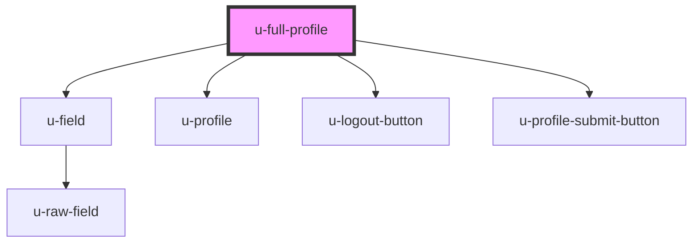

# u-full-profile

<!-- Auto Generated Below -->

## Properties

| Property                   | Attribute                     | Description | Type                | Default                 |
| -------------------------- | ----------------------------- | ----------- | ------------------- | ----------------------- |
| `countryCodeDisplayOption` | `country-code-display-option` |             | `"icon" \| "label"` | `"label"`               |
| `customAttributesTitle`    | `custom-attributes-title`     |             | `string`            | `"Custom Attributes"`   |
| `language`                 | `language`                    |             | `string`            | `undefined`             |
| `listOfFields`             | `list-of-fields`              |             | `string`            | `undefined`             |
| `logoutButtonClassName`    | `logout-button-class-name`    |             | `string`            | `""`                    |
| `logoutButtonText`         | `logout-button-text`          |             | `string`            | `"Logout"`              |
| `profileInformaitionTitle` | `profile-informaition-title`  |             | `string`            | `"Profile Information"` |
| `renderDefaultLabel`       | `render-default-label`        |             | `boolean`           | `true`                  |
| `sectionTitleClassName`    | `section-title-class-name`    |             | `string`            | `""`                    |
| `submitButtonText`         | `submit-button-text`          |             | `string`            | `"Submit"`              |

## Dependencies

### Depends on

- [u-field](../field)
- [u-profile](../profile)
- [u-logout-button](../../../auth/components/logout-button)
- [u-profile-submit-button](../unidy-submit-button)

### Graph

----------------------------------------------

*Built with [StencilJS](https://stenciljs.com/)*
