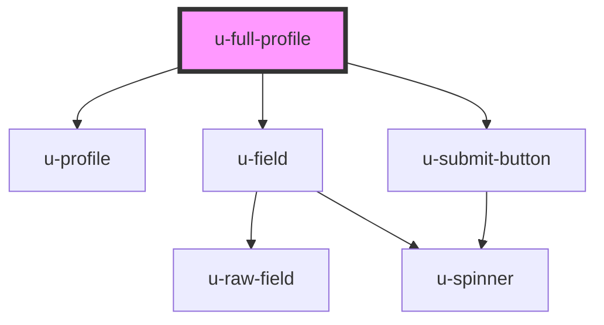

# u-full-profile

This component wraps `u-profile` and automatically renders all profile fields.

## Events

Events from the inner `u-profile` component (`uProfileChange`, `uProfileSuccess`, `uProfileError`) bubble up naturally through this component. See the [u-profile documentation](../profile/readme.md) for details on available events.

<!-- Auto Generated Below -->

## Properties

| Property                   | Attribute                     | Description                                                                                                       | Type                | Default     |
| -------------------------- | ----------------------------- | ----------------------------------------------------------------------------------------------------------------- | ------------------- | ----------- |
| `countryCodeDisplayOption` | `country-code-display-option` | How to display country codes in select fields: "icon" for flag emoji, "label" for text.                           | `"icon" \| "label"` | `"label"`   |
| `enableAutosave`           | `enable-autosave`             | Enable or disable autosave. When enabled, profile saves on blur by default, or after a delay if saveDelay is set. | `boolean`           | `false`     |
| `fields`                   | `fields`                      | Comma-separated list of field names to display. If not provided, all fields are shown.                            | `string`            | `undefined` |
| `saveDelay`                | `save-delay`                  | Optional delay in milliseconds before autosave triggers after the last change. If not set, saves on blur instead. | `number`            | `undefined` |

## Methods

### `submitProfile() => Promise<void>`

#### Returns

Type: `Promise<void>`

## Dependencies

### Depends on

- [u-profile](../profile)
- [u-field](../field)
- [u-submit-button](../../../shared/components/submit-button)

### Graph

----------------------------------------------

*Built with [StencilJS](https://stenciljs.com/)*
