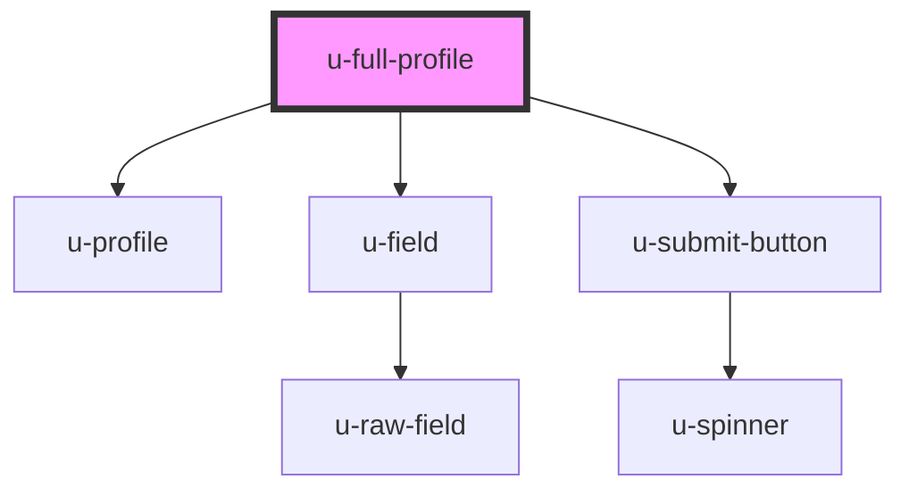

# u-full-profile

<!-- Auto Generated Below -->

## Properties

| Property                   | Attribute                     | Description | Type                | Default     |
| -------------------------- | ----------------------------- | ----------- | ------------------- | ----------- |
| `countryCodeDisplayOption` | `country-code-display-option` |             | `"icon" \| "label"` | `"label"`   |
| `fields`                   | `fields`                      |             | `string`            | `undefined` |

## Dependencies

### Depends on

- [u-profile](../profile)
- [u-field](../field)
- [u-submit-button](../../../shared/components/submit-button)

### Graph

----------------------------------------------

*Built with [StencilJS](https://stenciljs.com/)*
