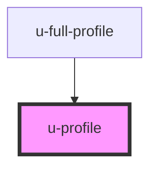

# u-profile

<!-- Auto Generated Below -->

## Properties

| Property        | Attribute        | Description | Type                                 | Default      |
| --------------- | ---------------- | ----------- | ------------------------------------ | ------------ |
| `autosave`      | `autosave`       |             | `"disabled" \| "enabled"`            | `"disabled"` |
| `autosaveDelay` | `autosave-delay` |             | `number`                             | `5000`       |
| `initialData`   | `initial-data`   |             | `string \| { [x: string]: string; }` | `""`         |
| `profileId`     | `profile-id`     |             | `string`                             | `undefined`  |

## Events

| Event             | Description | Type                                                                                                                               |
| ----------------- | ----------- | ---------------------------------------------------------------------------------------------------------------------------------- |
| `uProfileChange`  |             | `CustomEvent<{ data: ProfileRaw; field?: string; }>`                                                                               |
| `uProfileError`   |             | `CustomEvent<{ error: string; details: { fieldErrors?: Record<string, string>; httpStatus?: number; responseData?: unknown; }; }>` |
| `uProfileSuccess` |             | `CustomEvent<{ message: string; payload: ProfileRaw; }>`                                                                           |

## Methods

### `submitProfile() => Promise<void>`

#### Returns

Type: `Promise<void>`

## Dependencies

### Used by

 - [u-full-profile](../full-profile)

### Graph

----------------------------------------------

*Built with [StencilJS](https://stenciljs.com/)*
