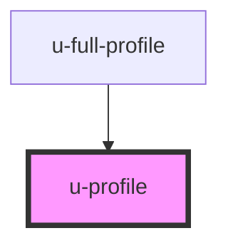

# u-profile

<!-- Auto Generated Below -->

## Properties

| Property        | Attribute        | Description                                                                          | Type                                 | Default      |
| --------------- | ---------------- | ------------------------------------------------------------------------------------ | ------------------------------------ | ------------ |
| `autosave`      | `autosave`       | Enable or disable autosave. When enabled, profile saves automatically after changes. | `"disabled" \| "enabled"`            | `"disabled"` |
| `autosaveDelay` | `autosave-delay` | Delay in milliseconds before autosave triggers after the last change.                | `number`                             | `5000`       |
| `initialData`   | `initial-data`   | Initial profile data as JSON string or object. If provided, skips fetching from API. | `string \| { [x: string]: string; }` | `""`         |
| `profileId`     | `profile-id`     | Optional profile ID for multi-profile scenarios.                                     | `string`                             | `undefined`  |

## Events

| Event             | Description                                                                       | Type                                                                                                                               |
| ----------------- | --------------------------------------------------------------------------------- | ---------------------------------------------------------------------------------------------------------------------------------- |
| `uProfileChange`  | Emitted whenever profile data changes. Useful for external state synchronization. | `CustomEvent<{ data: ProfileRaw; field?: string; }>`                                                                               |
| `uProfileError`   | Emitted when profile save fails, with error details including field-level errors. | `CustomEvent<{ error: string; details: { fieldErrors?: Record<string, string>; httpStatus?: number; responseData?: unknown; }; }>` |
| `uProfileSuccess` | Emitted when profile is successfully saved.                                       | `CustomEvent<{ message: string; payload: ProfileRaw; }>`                                                                           |

## Methods

### `submitProfile() => Promise<void>`

#### Returns

Type: `Promise<void>`

## Dependencies

### Used by

 - [u-full-profile](../full-profile)

### Graph

----------------------------------------------

*Built with [StencilJS](https://stenciljs.com/)*
