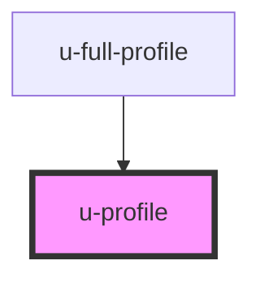

# u-profile

<!-- Auto Generated Below -->

## Properties

| Property      | Attribute      | Description                                                                          | Type                                 | Default     |
| ------------- | -------------- | ------------------------------------------------------------------------------------ | ------------------------------------ | ----------- |
| `initialData` | `initial-data` | Initial profile data as JSON string or object. If provided, skips fetching from API. | `string \| { [x: string]: string; }` | `""`        |
| `profileId`   | `profile-id`   | Optional profile ID (for multi-profile scenarios).                                   | `string`                             | `undefined` |

## Events

| Event             | Description                                                                              | Type                                                                                                                               |
| ----------------- | ---------------------------------------------------------------------------------------- | ---------------------------------------------------------------------------------------------------------------------------------- |
| `uProfileError`   | Fired on profile update failure. Contains error code and details including field errors. | `CustomEvent<{ error: string; details: { fieldErrors?: Record<string, string>; httpStatus?: number; responseData?: unknown; }; }>` |
| `uProfileSuccess` | Fired on successful profile update. Contains success message and updated profile data.   | `CustomEvent<{ message: string; payload: ProfileRaw; }>`                                                                           |

## Methods

### `submitProfile() => Promise<void>`

#### Returns

Type: `Promise<void>`

## Dependencies

### Used by

 - [u-full-profile](../full-profile)

### Graph

----------------------------------------------

*Built with [StencilJS](https://stenciljs.com/)*
