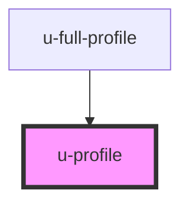

# u-profile

<!-- Auto Generated Below -->

## Properties

| Property            | Attribute            | Description                                                                                                                       | Type                                 | Default     |
| ------------------- | -------------------- | --------------------------------------------------------------------------------------------------------------------------------- | ------------------------------------ | ----------- |
| `enableAutosave`    | `enable-autosave`    | Enable or disable autosave. When enabled, profile saves on blur by default, or after a delay if saveDelay is set.                 | `boolean`                            | `false`     |
| `initialData`       | `initial-data`       | Initial profile data as JSON string or object. If provided, skips fetching from API.                                              | `string \| { [x: string]: string; }` | `""`        |
| `partialValidation` | `partial-validation` | When true, only validates and submits fields rendered as u-field components. Use when your form shows a subset of profile fields. | `boolean`                            | `false`     |
| `profileId`         | `profile-id`         | Optional profile ID for multi-profile scenarios.                                                                                  | `string`                             | `undefined` |
| `saveDelay`         | `save-delay`         | Optional delay in milliseconds before autosave triggers after the last change. If not set, saves on blur instead.                 | `number`                             | `undefined` |
| `validateFields`    | `validate-fields`    | Comma-separated list of fields to validate. Overrides auto-detection when partialValidation is true.                              | `string`                             | `undefined` |

## Events

| Event             | Description                                                                       | Type                                                                                                                               |
| ----------------- | --------------------------------------------------------------------------------- | ---------------------------------------------------------------------------------------------------------------------------------- |
| `uProfileChange`  | Emitted whenever profile data changes. Useful for external state synchronization. | `CustomEvent<{ data: ProfileRaw; field?: string; }>`                                                                               |
| `uProfileError`   | Emitted when profile save fails, with error details including field-level errors. | `CustomEvent<{ error: string; details: { fieldErrors?: Record<string, string>; httpStatus?: number; responseData?: unknown; }; }>` |
| `uProfileSuccess` | Emitted when profile is successfully saved.                                       | `CustomEvent<{ message: string; payload: ProfileRaw; }>`                                                                           |

## Methods

### `registerField(fieldName: string) => Promise<void>`

Register a field for partial validation tracking.
Called by child u-field components when they mount.

#### Parameters

| Name        | Type     | Description |
| ----------- | -------- | ----------- |
| `fieldName` | `string` |             |

#### Returns

Type: `Promise<void>`

### `submitProfile() => Promise<void>`

#### Returns

Type: `Promise<void>`

### `unregisterField(fieldName: string) => Promise<void>`

Unregister a field from partial validation tracking.
Called by child u-field components when they unmount.

#### Parameters

| Name        | Type     | Description |
| ----------- | -------- | ----------- |
| `fieldName` | `string` |             |

#### Returns

Type: `Promise<void>`

## Dependencies

### Used by

 - [u-full-profile](../full-profile)

### Graph

----------------------------------------------

*Built with [StencilJS](https://stenciljs.com/)*
