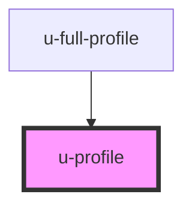

# unidy-profile

<!-- Auto Generated Below -->

## Properties

| Property      | Attribute      | Description | Type                                 | Default     |
| ------------- | -------------- | ----------- | ------------------------------------ | ----------- |
| `apiKey`      | `api-key`      |             | `string`                             | `undefined` |
| `apiUrl`      | `api-url`      |             | `string`                             | `undefined` |
| `initialData` | `initial-data` |             | `string \| { [x: string]: string; }` | `""`        |
| `language`    | `language`     |             | `string`                             | `undefined` |
| `profileId`   | `profile-id`   |             | `string`                             | `undefined` |

## Dependencies

### Used by

 - [u-full-profile](../full-profile)

### Graph

----------------------------------------------

*Built with [StencilJS](https://stenciljs.com/)*
