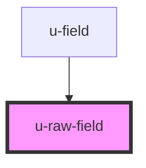

# u-raw-field

<!-- Auto Generated Below -->

## Properties

| Property                   | Attribute                     | Description | Type                                                                   | Default                                |
| -------------------------- | ----------------------------- | ----------- | ---------------------------------------------------------------------- | -------------------------------------- |
| `ariaDescribedBy`          | `aria-described-by`           |             | `string`                                                               | `""`                                   |
| `attrName`                 | `attr-name`                   |             | `string`                                                               | `undefined`                            |
| `checked`                  | `checked`                     |             | `boolean`                                                              | `undefined`                            |
| `componentClassName`       | `class-name`                  |             | `string`                                                               | `undefined`                            |
| `countryCodeDisplayOption` | `country-code-display-option` |             | `"icon" \| "label"`                                                    | `"label"`                              |
| `disabled`                 | `disabled`                    |             | `boolean`                                                              | `undefined`                            |
| `emptyOption`              | `empty-option`                |             | `boolean`                                                              | `false`                                |
| `field` _(required)_       | `field`                       |             | `string`                                                               | `undefined`                            |
| `invalidPhoneMessage`      | `invalid-phone-message`       |             | `string`                                                               | `"Please enter a valid phone number."` |
| `multiSelectOptions`       | --                            |             | `MultiSelectOption[]`                                                  | `undefined`                            |
| `options`                  | `options`                     |             | `Option[] \| string`                                                   | `undefined`                            |
| `pattern`                  | `pattern`                     |             | `string`                                                               | `undefined`                            |
| `patternErrorMessage`      | `pattern-error-message`       |             | `string`                                                               | `undefined`                            |
| `placeholder`              | `placeholder`                 |             | `string`                                                               | `undefined`                            |
| `radioOptions`             | --                            |             | `RadioOption[]`                                                        | `undefined`                            |
| `readonlyPlaceholder`      | `readonly-placeholder`        |             | `string`                                                               | `""`                                   |
| `required`                 | `required`                    |             | `boolean`                                                              | `false`                                |
| `specificPartKey`          | `specific-part-key`           |             | `string`                                                               | `undefined`                            |
| `tooltip`                  | `tooltip`                     |             | `string`                                                               | `undefined`                            |
| `type` _(required)_        | `type`                        |             | `string`                                                               | `undefined`                            |
| `validationFunc`           | --                            |             | `(value: string \| string[]) => { valid: boolean; message?: string; }` | `undefined`                            |
| `value`                    | `value`                       |             | `string \| string[]`                                                   | `undefined`                            |

## Events

| Event          | Description                                                                                     | Type                              |
| -------------- | ----------------------------------------------------------------------------------------------- | --------------------------------- |
| `uFieldSubmit` | Emitted when the user presses Enter (or Cmd/Ctrl+Enter in textareas) to submit the field value. | `CustomEvent<{ field: string; }>` |

## Dependencies

### Used by

 - [u-field](../field)

### Graph

----------------------------------------------

*Built with [StencilJS](https://stenciljs.com/)*
