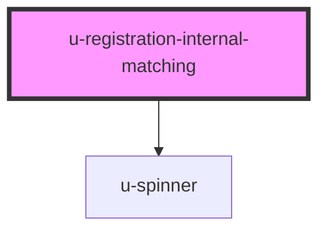

# u-registration-internal-matching

<!-- Auto Generated Below -->

## Properties

| Property                   | Attribute                     | Description                                                                                                 | Type     | Default |
| -------------------------- | ----------------------------- | ----------------------------------------------------------------------------------------------------------- | -------- | ------- |
| `componentClassName`       | `class-name`                  | CSS classes to apply to the wrapper element.                                                                | `string` | `""`    |
| `errorClassName`           | `error-class-name`            | CSS classes to apply to error message elements.                                                             | `string` | `""`    |
| `inputClassName`           | `input-class-name`            | CSS classes to apply to text and date input fields.                                                         | `string` | `""`    |
| `primaryButtonClassName`   | `primary-button-class-name`   | CSS classes to apply to primary action buttons ("Find Account" and "Yes, use this account").                | `string` | `""`    |
| `secondaryButtonClassName` | `secondary-button-class-name` | CSS classes to apply to secondary action buttons ("Continue without linking" and "No, create new account"). | `string` | `""`    |

## Events

| Event        | Description                                                                                                                                                        | Type                                 |
| ------------ | ------------------------------------------------------------------------------------------------------------------------------------------------------------------ | ------------------------------------ |
| `matchFound` | Fired when an internal match is found after submitting the form. Use this event to populate a custom `slot="match-preview"` element with the matched account data. | `CustomEvent<MatchFoundEventDetail>` |

## Dependencies

### Depends on

- [u-spinner](../../../shared/components/spinner)

### Graph

----------------------------------------------

*Built with [StencilJS](https://stenciljs.com/)*
