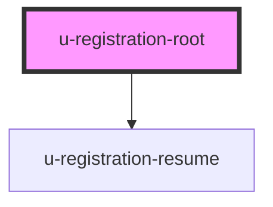

# u-registration-root

Container component that manages a multi-step registration flow. Wraps `<u-registration-step>` children and handles flow creation, step navigation, and auto-resume.

## Resume Flow

When a user receives a resume email and clicks the link, they are redirected to the `registration-url` with a `?registration_rid=<rid>` query parameter. On load, the component:

1. Detects the `registration_rid` in the URL
2. Fetches the registration flow from the server, restoring all collected data
3. Skips past already-completed steps (e.g. email verification, password)
4. Cleans the `registration_rid` from the URL

If no URL parameter is present, the component checks localStorage for a stored rid and attempts to resume from that.

## Usage

```html
<u-registration-root steps='["email", "profile", "password"]'>
  <u-registration-step name="email">
    <!-- email collection UI -->
  </u-registration-step>
  <u-registration-step name="profile">
    <!-- profile fields -->
  </u-registration-step>
  <u-registration-step name="password" requires-password>
    <!-- password field, skipped for social/passwordless -->
  </u-registration-step>
</u-registration-root>
```

The `registration-url` prop is optional. If omitted, it defaults to the current page URL (`origin + pathname`), which is usually the correct value. Only set it explicitly if the resume link should redirect to a different page than where the component is rendered.

## Email Verification

Email verification during registration is **optional**. You have two approaches:

### Interactive verification (inline step)

Include a `"verification"` step in the `steps` array and add `requires-email-verification` to the step. The user enters a 4-digit code before continuing. The step is automatically skipped when the email is already verified (e.g. via social login).

```html
<u-registration-root steps='["email", "verification", "password"]'>
  <u-registration-step name="verification" requires-email-verification>
    <u-registration-email-verification auto-send></u-registration-email-verification>
  </u-registration-step>
  <!-- other steps -->
</u-registration-root>
```

### Deferred verification (post-finalization email)

Omit the `"verification"` step entirely. Registration completes immediately and Devise automatically sends a standard confirmation email to the user after their account is created. The user account exists but is unconfirmed until they click the link.

```html
<!-- No "verification" step — confirmation email is sent automatically on finalization -->
<u-registration-root steps='["email", "password"]'>
  <!-- steps -->
</u-registration-root>
```

This is the recommended approach when the registration flow includes other interactive steps (e.g. `internal-matching`) where interrupting the flow for email verification would hurt UX.

## Resume UI (`emailAlreadyInFlow`)

When a user tries to register with an email that already has an in-progress flow, the API returns `registration_flow_already_exists`. The root automatically renders a `<u-registration-resume>` button at the **top** of its content (above all steps) so the user can request a resume link regardless of which step is configured first.

Provide button text via the `resume` slot and style it with `resume-class-name`:

```html
<u-registration-root
  steps='["profile-password", "passkey"]'
  resume-class-name="w-full mb-4 px-4 py-2 bg-yellow-100 text-yellow-800 border border-yellow-300 rounded-lg">
  <span slot="resume">Send me a resume link</span>

  <u-registration-step name="profile-password"><!-- ... --></u-registration-step>
</u-registration-root>
```

### Custom positioning

If you need the resume button in a different position (e.g. inline inside a specific step), set `disable-auto-resume` and place `<u-registration-resume>` yourself:

```html
<u-registration-root steps='["email", "profile"]' disable-auto-resume>
  <u-registration-step name="email">
    <!-- resume button sits between the email field and the submit button -->
    <u-registration-resume class-name="...">Send resume link</u-registration-resume>
    <u-submit-button class-name="...">Continue</u-submit-button>
  </u-registration-step>
</u-registration-root>
```

`<u-registration-resume>` always self-hides when there is no conflicting flow, so it is safe to place it globally or inside any step.

<!-- Auto Generated Below -->


## Properties

| Property            | Attribute             | Description                                                                                                                                                           | Type      | Default     |
| ------------------- | --------------------- | --------------------------------------------------------------------------------------------------------------------------------------------------------------------- | --------- | ----------- |
| `autoResume`        | `auto-resume`         | Whether to automatically resume an existing registration flow on load. Checks for `registration_rid` in the URL (from resume emails) or a stored rid in localStorage. | `boolean` | `true`      |
| `brandId`           | `brand-id`            | Brand ID to associate with the registration flow. Only needed in multi-brand setups.                                                                                  | `number`  | `undefined` |
| `disableAutoResume` | `disable-auto-resume` | When true, suppresses the automatically-rendered `<u-registration-resume>` so you can place your own `<u-registration-resume>` at a custom position inside the root.  | `boolean` | `false`     |
| `registrationUrl`   | `registration-url`    | URL of the registration page. Used as the redirect target in resume emails. Defaults to the current page URL (origin + pathname) if not set.                          | `string`  | `undefined` |
| `resumeClassName`   | `resume-class-name`   | CSS classes to apply to the automatically-rendered resume button. Accepts Tailwind classes.                                                                           | `string`  | `undefined` |
| `steps`             | `steps`               | JSON array string of step names that define the registration flow order. Each name must match a `<u-registration-step name="...">` child.                             | `string`  | `"[]"`      |


## Events

| Event                  | Description                                                                    | Type                                                                                                                                                                                                                                                                                                                                                                                                                                                                                           |
| ---------------------- | ------------------------------------------------------------------------------ | ---------------------------------------------------------------------------------------------------------------------------------------------------------------------------------------------------------------------------------------------------------------------------------------------------------------------------------------------------------------------------------------------------------------------------------------------------------------------------------------------- |
| `errorEvent`           | Fired when an error occurs during the registration flow.                       | `CustomEvent<{ error: string; }>`                                                                                                                                                                                                                                                                                                                                                                                                                                                              |
| `registrationComplete` | Fired when the registration flow is finalized and the user account is created. | `CustomEvent<{ rid: string; status: Record<string, boolean>; created_at: string; updated_at: string; expires_at: string; expired: boolean; can_finalize: boolean; email_verified: boolean; email?: string; newsletter_preferences?: Record<string, string[]>; registration_profile_data?: Record<string, unknown>; social_provider?: string; has_passkey?: boolean; has_password?: boolean; auth?: { id_token: string; refresh_token: string; }; } & { requiresEmailConfirmation: boolean; }>` |
| `stepChange`           | Fired when the active step changes.                                            | `CustomEvent<{ stepName: string; stepIndex: number; }>`                                                                                                                                                                                                                                                                                                                                                                                                                                        |


## Methods

### `advanceToNextStep() => Promise<void>`

Programmatically advance to the next step in the registration flow.

#### Returns

Type: `Promise<void>`


### `getBrandId() => Promise<number | undefined>`

Returns the configured brand ID, if any.

#### Returns

Type: `Promise<number>`


### `getRegistrationUrl() => Promise<string>`

Returns the registration URL. Falls back to the current page URL if not explicitly set.

#### Returns

Type: `Promise<string>`


### `goToPreviousStep() => Promise<void>`

Programmatically go back to the previous step in the registration flow.

#### Returns

Type: `Promise<void>`


### `isComplete() => Promise<boolean>`

Returns whether the registration flow has been completed.

#### Returns

Type: `Promise<boolean>`


## Dependencies

### Depends on

- [u-registration-resume](../registration-resume)

### Graph


----------------------------------------------

*Built with [StencilJS](https://stenciljs.com/)*
