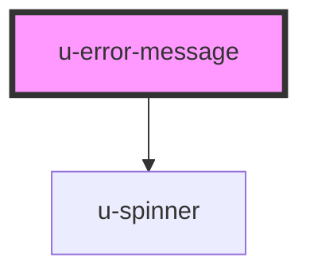

# u-error-message

<!-- Auto Generated Below -->

## Properties

| Property             | Attribute    | Description | Type                       | Default     |
| -------------------- | ------------ | ----------- | -------------------------- | ----------- |
| `componentClassName` | `class-name` |             | `string`                   | `""`        |
| `errorMessages`      | --           |             | `{ [x: string]: string; }` | `undefined` |
| `for` _(required)_   | `for`        |             | `string`                   | `undefined` |

## Dependencies

### Depends on

- [u-spinner](../spinner)

### Graph

----------------------------------------------

*Built with [StencilJS](https://stenciljs.com/)*
