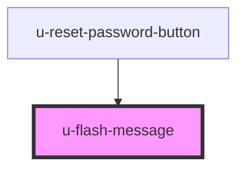

# error-message

<!-- Auto Generated Below -->

## Properties

| Property             | Attribute    | Description | Type     | Default |
| -------------------- | ------------ | ----------- | -------- | ------- |
| `componentClassName` | `class-name` |             | `string` | `""`    |

## Dependencies

### Used by

 - [u-reset-password-button](../../../auth/components/reset-pass-button)

### Graph

----------------------------------------------

*Built with [StencilJS](https://stenciljs.com/)*
