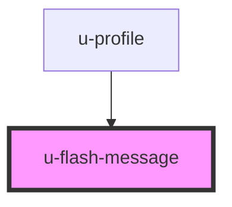

# u-flash-message

<!-- Auto Generated Below -->

## Properties

| Property             | Attribute              | Description | Type     | Default |
| -------------------- | ---------------------- | ----------- | -------- | ------- |
| `componentClassName` | `class-name`           |             | `string` | `""`    |
| `removeAfterSeconds` | `remove-after-seconds` |             | `number` | `null`  |

## Dependencies

### Used by

 - [u-profile](../../../profile/components/profile)

### Graph

----------------------------------------------

*Built with [StencilJS](https://stenciljs.com/)*
