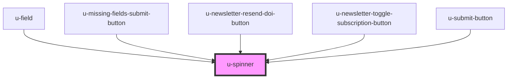

# u-spinner

A flexible, reusable spinner component for indicating loading states.

## Basic Usage

To use the spinner, simply include the `<u-spinner>` tag in your HTML or component's render method.

```html
<u-spinner></u-spinner>
```

## Styling (Recommended)

### CSS Custom Properties

The recommended way to style the spinner is by using CSS Custom Properties. This provides a clean API for styling without needing to know the component's internal structure.

| Property | Description | Example |
|----------|-------------|---------|
| `--u-spinner-font-size` | Controls the size of the spinner | `20px`, `1.5rem` |
| `--spinner-color-primary` | Color of the main rotating part | `#fff`, `currentColor` |
| `--spinner-color-secondary` | Color of the track/background | `rgba(255, 255, 255, 0.4)` |

**Example: A 20px white spinner for a dark button**

```css
u-profile-submit-button {
  --u-spinner-font-size: 20px;
  --spinner-color-primary: #fff;
  --spinner-color-secondary: rgba(255, 255, 255, 0.4);
}
```

**Example: Using currentColor to inherit text color**

```css
.my-button {
  color: #3b82f6;
  --spinner-color-primary: currentColor;
  --spinner-color-secondary: rgba(59, 130, 246, 0.2);
}
```

## Advanced Styling with ::part

For more direct control, the spinner exposes a `part` named `spinner`. You can target this with the `::part()` pseudo-element to apply any CSS directly to the internal spinning element.

⚠️ **Note:** This approach is more powerful but can be brittle. For example, if you set the `width` directly, you will also need to manually calculate and set the `border-width` to maintain proper proportions.

### Sizing with ::part

As an alternative to the `--u-spinner-font-size` custom property, you can control the size by setting the `font-size` on the `spinner` part. The component's internal `em` units will scale accordingly.

```css
/* This will result in a 30px spinner with a 3px border */
u-profile-submit-button::part(spinner) {
  font-size: 30px;
}
```

## Spinner with Text

The recommended way to display text next to a spinner is to wrap both the `<u-spinner>` and the text in a container element. This gives you maximum layout flexibility.

**HTML:**

```html
<div class="loading-indicator">
  <u-spinner></u-spinner>
  <span>Loading...</span>
</div>
```

**CSS:**

```css
.loading-indicator {
  display: inline-flex;
  align-items: center;
  gap: 0.5rem; /* Adjust spacing as needed */
}
```

<!-- Auto Generated Below -->


## Shadow Parts

| Part        | Description |
| ----------- | ----------- |
| `"spinner"` |             |


## Dependencies

### Used by

 - [u-field](../../../profile/components/field)
 - [u-missing-fields-submit-button](../../../auth/components/missing-fields-submit-button)
 - [u-newsletter-resend-doi-button](../../../newsletter/components/resend-doi-button)
 - [u-newsletter-toggle-subscription-button](../../../newsletter/components/toggle-subscription-button)
 - [u-submit-button](../submit-button)

### Graph


----------------------------------------------

*Built with [StencilJS](https://stenciljs.com/)*
