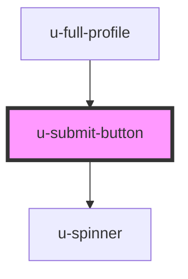

# u-submit-button

<!-- Auto Generated Below -->

## Properties

| Property             | Attribute    | Description | Type                                                                                | Default     |
| -------------------- | ------------ | ----------- | ----------------------------------------------------------------------------------- | ----------- |
| `componentClassName` | `class-name` |             | `string`                                                                            | `""`        |
| `disabled`           | `disabled`   |             | `boolean`                                                                           | `false`     |
| `for`                | `for`        |             | `"create" \| "email" \| "login" \| "password" \| "resetPassword" \| "single-login"` | `undefined` |
| `text`               | `text`       |             | `string`                                                                            | `undefined` |

## Dependencies

### Used by

 - [u-full-profile](../../../profile/components/full-profile)

### Depends on

- [u-spinner](../spinner)

### Graph

----------------------------------------------

*Built with [StencilJS](https://stenciljs.com/)*
