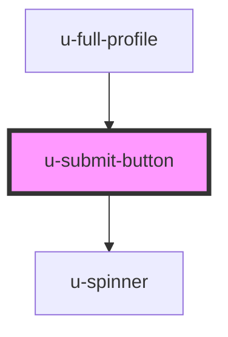

# u-submit-button

<!-- Auto Generated Below -->

## Properties

| Property             | Attribute    | Description                                                                                                                      | Type                                                                                | Default     |
| -------------------- | ------------ | -------------------------------------------------------------------------------------------------------------------------------- | ----------------------------------------------------------------------------------- | ----------- |
| `componentClassName` | `class-name` | CSS classes to apply to the button element.                                                                                      | `string`                                                                            | `""`        |
| `disabled`           | `disabled`   | If true, the button will be disabled.                                                                                            | `boolean`                                                                           | `false`     |
| `for`                | `for`        | The action type for the button. Varies by context (auth: email/password/magic-code/reset-password, newsletter: subscribe/login). | `"create" \| "email" \| "login" \| "password" \| "resetPassword" \| "single-login"` | `undefined` |
| `text`               | `text`       | Custom button text. If not provided, uses context-specific defaults.                                                             | `string`                                                                            | `undefined` |

## Dependencies

### Used by

 - [u-full-profile](../../../profile/components/full-profile)

### Depends on

- [u-spinner](../spinner)

### Graph

----------------------------------------------

*Built with [StencilJS](https://stenciljs.com/)*
