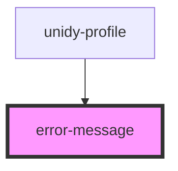

# error-message

<!-- Auto Generated Below -->

## Properties

| Property  | Attribute | Description | Type     | Default |
| --------- | --------- | ----------- | -------- | ------- |
| `message` | `message` |             | `string` | `""`    |

## Dependencies

### Used by

 - [unidy-profile](../unidy-profile)

### Graph

----------------------------------------------

*Built with [StencilJS](https://stenciljs.com/)*
