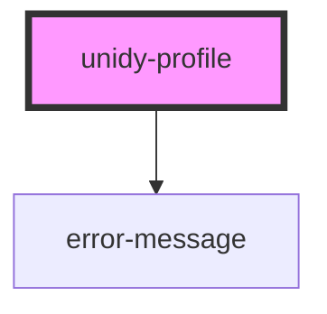

# unidy-profile

<!-- Auto Generated Below -->

## Properties

| Property              | Attribute                | Description | Type                                 | Default                                                                                                                                            |
| --------------------- | ------------------------ | ----------- | ------------------------------------ | -------------------------------------------------------------------------------------------------------------------------------------------------- |
| `apiKey`              | `api-key`                |             | `string \| undefined`                | `undefined`                                                                                                                                        |
| `apiUrl`              | `api-url`                |             | `string \| undefined`                | `undefined`                                                                                                                                        |
| `initialData`         | `initial-data`           |             | `string \| { [x: string]: string; }` | `""`                                                                                                                                               |
| `profileId`           | `profile-id`             |             | `string \| undefined`                | `undefined`                                                                                                                                        |
| `store`               | `store`                  |             | `ObservableMap<ProfileStore>`        | `createStore<ProfileStore>({     loading: true,     data: {},     configuration: {},     errors: {},     idToken: "",     client: undefined,   })` |
| `useUnidyAuthEnabled` | `use-unidy-auth-enabled` |             | `boolean \| undefined`               | `undefined`                                                                                                                                        |

## Dependencies

### Depends on

- [error-message](../errors)

### Graph

----------------------------------------------

*Built with [StencilJS](https://stenciljs.com/)*
